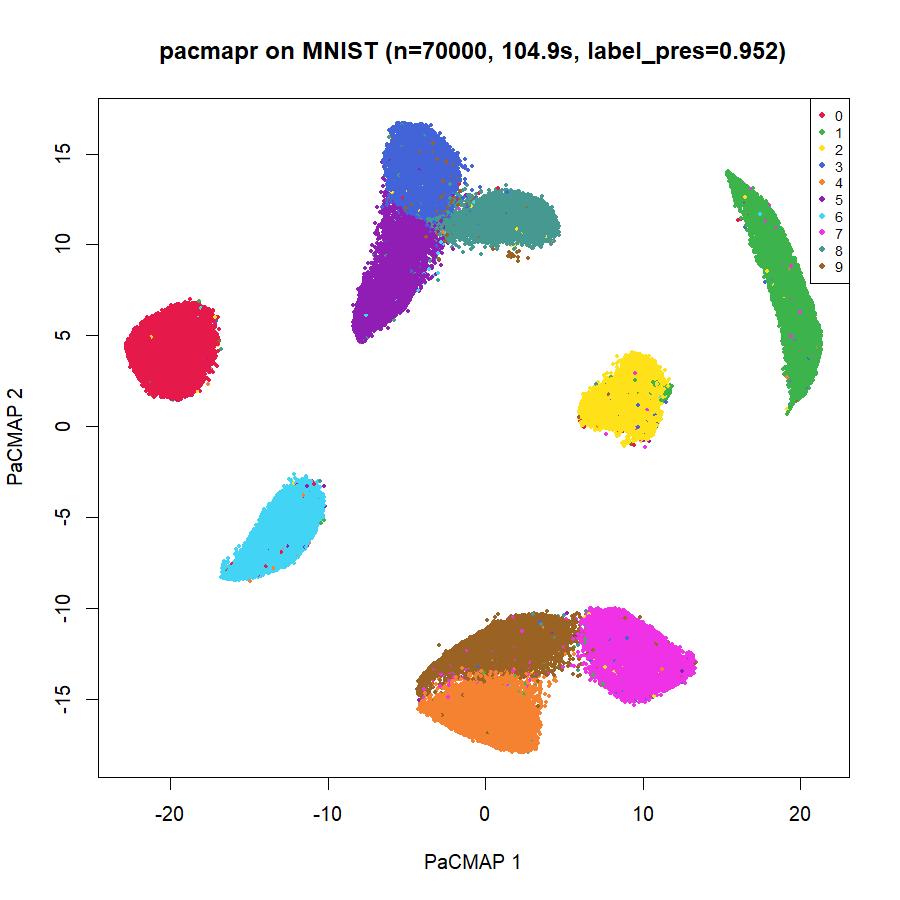

# pacmapr

Native R implementation of **PaCMAP** — *Pairwise Controlled Manifold Approximation Projection*, a fast dimensionality-reduction method that preserves both local and global structure (Wang, Huang, Rudin & Shaposhnik, *JMLR* 2021).

## Quick start

```r
# install.packages("remotes")
remotes::install_github("williamsyy/pacmap-for-R")

library(pacmapr)
X   <- as.matrix(iris[, 1:4])
emb <- pacmap(X, random_state = 42)
plot(emb$embedding, col = iris$Species, pch = 19)
```

## Installation

You need a C++17 compiler and the standard R build toolchain.

|         | one-time setup                                            |
|---------|-----------------------------------------------------------|
| Windows | `winget install RProject.Rtools`                          |
| macOS   | `xcode-select --install`                                  |
| Linux   | `sudo apt install build-essential` (or equivalent)        |

Then:

```r
remotes::install_github("williamsyy/pacmap-for-R")
```

CRAN dependencies (`Rcpp`, `RcppHNSW`, `RSpectra`) are pulled in automatically.

## Features

- **`pacmap()`** — fit a PaCMAP embedding.
- **`localmap()`** — fit a LocalMAP embedding (adds phase-3 local FP resampling + modified NN gradient; extra hyperparameter `low_dist_thres`).
- **`transform()`** — embed new points into an existing model.
- **`save_pacmap()` / `load_pacmap()`** — one-file `.rds` persistence.
- **`find_pacmap_pairs()`** — expose the pair-sampling step for inspection or reuse.
- **Distance metrics** — `euclidean`, `manhattan`, `angular`, `hamming`, and `precomputed` (pass an *n × n* distance matrix instead of a feature matrix; mirrors the [LocalMAP precomputed-distance branch](https://github.com/williamsyy/LocalMAP/tree/feature/precomputed-distance-matrix)).
- **ANN backends** — [`RcppHNSW`](https://github.com/jlmelville/rcpphnsw) by default (all platforms), or [`faissR`](https://github.com/tkcaccia/faissR) via `ann_backend = "faiss"`. `faissR`'s default install refuses on Windows (`OS_type: unix`); Windows users need one of the paths described in [faissR's installation guide](https://github.com/tkcaccia/faissR/blob/main/docs/installation.md#windows-installation-for-faissr) (WSL2 or a manual FAISS+Rtools build).
- **Deterministic** — same `random_state` → identical embedding.

## Benchmark: MNIST

Full MNIST, 70 000 images × 784 pixels → 2D:

| n         | wall-clock  | label preservation @ 10 |
|----------:|------------:|------------------------:|
|    10 000 |     7.4 s   | 0.903                   |
|    30 000 |    28.0 s   | 0.937                   |
| **70 000** | **77.4 s**  | **0.952**              |

Windows 11 laptop, 21 threads (parallel gradient + multi-threaded HNSW), default hyperparameters (`num_iters = c(100, 100, 250)`). Reproduce with

```r
Rscript inst/scripts/mnist.R
```

*Label preservation @ 10 = fraction of a point's 10 nearest neighbours in the embedding that share its true digit label; 0.952 means 9½ out of 10 on average.*



## Advanced usage

### Embed new points into a fitted model

```r
train <- as.matrix(iris[1:100, 1:4])
new   <- as.matrix(iris[101:150, 1:4])

fit <- pacmap(train, random_state = 42)
tr  <- transform(fit, new)          # 50 x 2 embedding for the held-out points
```

### Precomputed distance matrix

Useful when you already have a custom distance (kernel, biological similarity, etc.):

```r
D   <- as.matrix(dist(X, method = "manhattan"))
emb <- pacmap(D, distance = "precomputed", random_state = 42)
```

`apply_pca` is disabled automatically, `init` defaults to `"random"`, and `transform()` is not supported in this mode.

### FAISS backend

An alternative ANN backend via [tkcaccia/faissR](https://github.com/tkcaccia/faissR), useful for very large *n* if you're willing to pull in a system dependency. Once `faissR` is installed:

```r
emb <- pacmap(X, ann_backend = "faiss")       # explicit
emb <- pacmap(X, ann_backend = "auto")        # faiss if installed, else hnsw
```

Installing `faissR` itself depends on your OS. The authoritative guide is [`faissR`'s installation.md](https://github.com/tkcaccia/faissR/blob/main/docs/installation.md); the short version:

**macOS:**
```sh
brew install faiss libomp
```
```r
remotes::install_github("tkcaccia/faissR")
```

**Linux:** install `libfaiss-dev` (Debian/Ubuntu: `sudo apt install libfaiss-dev`) or build FAISS from source with CMake, then `remotes::install_github("tkcaccia/faissR")`.

**Windows:** `remotes::install_github("tkcaccia/faissR")` will fail with `ERROR: Unix-only package` because faissR's `DESCRIPTION` sets `OS_type: unix` — the automated builders can't produce a Windows-compatible FAISS. Two supported workarounds, both non-trivial (see the [Windows section of the guide](https://github.com/tkcaccia/faissR/blob/main/docs/installation.md#windows-installation-for-faissr)):

1. **WSL2** (recommended) — install a Linux distribution via `wsl --install`, then follow the Linux path inside it. Your work has to happen inside WSL2, not native Windows R.
2. **Native Rtools + FAISS from source** — build FAISS with CMake using the same mingw-w64 toolchain as Rtools, set `FAISS_HOME` to the install prefix, patch/override `OS_type: unix`, then `R CMD INSTALL .` from a `faissR` checkout. Expect 1-3 hours of CMake fiddling for a first attempt.

The default HNSW backend works everywhere with zero extra deps and produces indistinguishable embedding quality; unless you specifically need FAISS's ANN implementation, you can skip this section.

### Save and reload a model

```r
save_pacmap(fit, "fit.rds")
fit2 <- load_pacmap("fit.rds")
identical(fit$embedding, fit2$embedding)      # TRUE
```

## Citation

```r
citation("pacmapr")
```

Please cite both the R package and the [original PaCMAP paper](https://www.jmlr.org/papers/v22/20-1061.html) (Wang et al., *JMLR* 2021).

## License

MIT. See [`LICENSE`](LICENSE).
